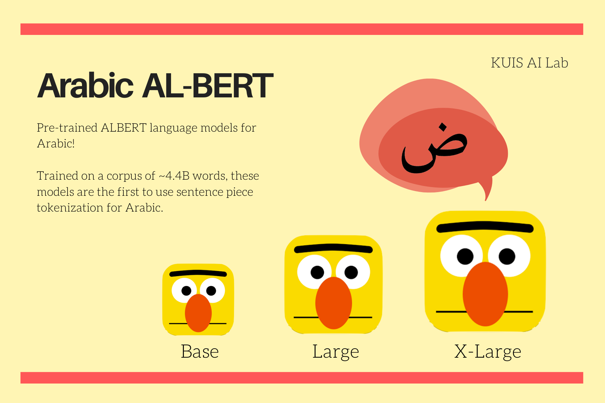

# Arabic-ALBERT



## Pretraining data

_If you use any of these models in your work, please cite this work as:_

```
@software{ali_safaya_2020_4718724,
  author       = {Ali Safaya},
  title        = {Arabic-ALBERT},
  month        = aug,
  year         = 2020,
  publisher    = {Zenodo},
  version      = {1.0.0},
  doi          = {10.5281/zenodo.4718724},
  url          = {https://doi.org/10.5281/zenodo.4718724}
}
```

The models were pretrained on ~4.4 Billion words:

- Arabic version of [OSCAR](https://oscar-corpus.com/) (unshuffled version of the corpus) - filtered from [Common Crawl](http://commoncrawl.org/)
- Recent dump of Arabic [Wikipedia](https://dumps.wikimedia.org/backup-index.html)

__Notes on training data:__

- Our final version of corpus contains some non-Arabic words inlines, which we did not remove from sentences since that would affect some tasks like NER.
- Although non-Arabic characters were lowered as a preprocessing step, since Arabic characters do not have upper or lower case, there is no cased and uncased version of the model.
- The corpus and vocabulary set are not restricted to Modern Standard Arabic, they contain some dialectical Arabic too.

## Pretraining details

- These models were trained using Google ALBERT's github [repository](https://github.com/google-research/albert) on a single TPU v3-8 provided for free from [TFRC](https://www.tensorflow.org/tfrc).
- Our pretraining procedure follows training settings of bert with some changes: trained for 7M training steps with batchsize of 64, instead of 125K with batchsize of 4096.

## Models

|  | albert-base | albert-large | albert-xlarge |
|:---:|:---:|:---:|:---:|
| Hidden Layers | 12 | 24 | 24 |
| Attention heads | 12 | 16 | 32 |
| Hidden size | 768 | 1024 | 2048 |

## Results

__Note:__ More results on other downstream NLP tasks will be added soon. if you use any of these models, we would appreciate your feedback.

## How to use

You can use these models by installing `torch` or `tensorflow` and Huggingface library `transformers`. And you can use it directly by initializing it like this:  

```python

from transformers import AutoTokenizer, AutoModel

# loading the tokenizer
base_tokenizer    = AutoTokenizer.from_pretrained("kuisailab/albert-base-arabic")
large_tokenizer   = AutoTokenizer.from_pretrained("kuisailab/albert-large-arabic")
xlarge_tokenizer  = AutoTokenizer.from_pretrained("kuisailab/albert-xlarge-arabic")

# loading the model
base_model   = AutoModel.from_pretrained("kuisailab/albert-base-arabic")
large_model  = AutoModel.from_pretrained("kuisailab/albert-large-arabic")
xlarge_model = AutoModel.from_pretrained("kuisailab/albert-xlarge-arabic")

```

## Acknowledgement

Thanks to Google for providing free TPU for the training process and for Huggingface for hosting these models on their servers 😊
